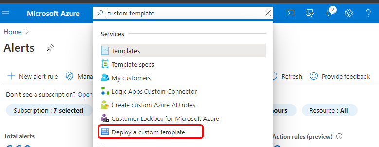
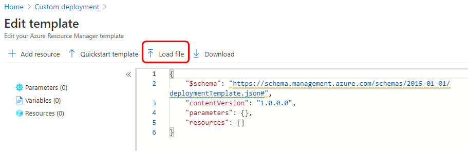
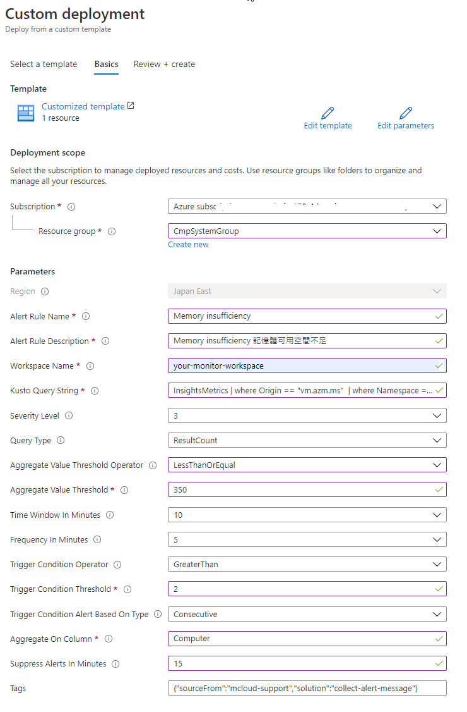

# 快速建立 Azure Alert 告警詳細說明
> 複製 MCB Monitor Portal 提供的 MCB Dashoard 圖表使用的查詢字串，搭配 ARM 執行範本 M-general-alert.json ，可以快速建立一般與嚴重等級 Azure Alert 告警功能，並自動傳遞告警訊息到 MCB Portal 事件中心
> 此功能僅支援 MCB [進階儀錶板](../workspace/SETUP.md)

## 以下步驟前置作業流程
1. 登入 MCB Portal > 監控 > 右上角 "更多監控資訊" 進入 MCB Monitor Portal
2. 選擇 左下角 Preference，先確認目前所在的 Organizations 是正確的，Role 必須是Editor
3. 回到左列功能表選擇 Dashboard，切換至您的 Dashboard，選擇如下的看板，此例為記憶體可用空間圖表，如下圖所示，切換進入 Edit 畫面
4. 
5. 複製下圖查詢字串的內容
6. 
7. 根據查詢字串 Kusto 語法，進行修正，[什麼是 Kusto 可參考官方教學](https://docs.microsoft.com/zh-tw/azure/data-explorer/kusto/concepts/)
8. 刪除此行 >> ```| where $__timeFilter(TimeGenerated)```
9. 修改 summarize 後面的關鍵字為 AvailabledValue

修正前的查詢字串
```
InsightsMetrics
| where $__timeFilter(TimeGenerated)
| where Origin == "vm.azm.ms" 
| where Namespace == "Memory" 
| where Name == "AvailableMB" 
| summarize AvailableMB= avg(Val) by Computer, bin(TimeGenerated, 1m) 
| order by TimeGenerated asc
```

修正後的查詢字串
```
InsightsMetrics
| where Origin == "vm.azm.ms" 
| where Namespace == "Memory" 
| where Name == "AvailableMB" 
| summarize AvailabledValue= avg(Val) by Computer, bin(TimeGenerated, 1m) 
| order by TimeGenerated asc
```
10. 找出依據哪個欄位進行加總 Aggregated Column，此例是 (by 之後的欄位) Computer
```
| summarize AvailabledValue= avg(Val) by Computer, bin(TimeGenerated, 1m)
```
11. 若遇到有等號出現的例子，等號左邊是 Alais naming，例如下面的例子，加總的欄位 Aggregated Column 則是 VM

```
| summarize AvailabledValue= avg(Val) by VM = Computer, bin(TimeGenerated, 1m)
```

## 以下是快速建置 Azure Alert 流程說明
1. 下載右側 ARM 執行範本 M-general-alert.json，請另存JSON檔 [](https://portal.azure.com/#create/Microsoft.Template/uri/https%3A%2F%2Fraw.githubusercontent.com%2Fmcloud-support%2Farm%2Fmain%2Falert%2FM-general-alert.json)
2. 以 CSP 身分登入 Azure Portal，經由 My Customers 切換到客戶資源，在上方搜尋欄輸入 "custom template"，找到 Deploy a custom template 功能，如下圖所示
3. 
4. 出現 Custom deployment 功能頁，點選 Build your own template in the editor，出現 Edit template 功能，選擇上方 Load file，如下圖所示
5. 
6. 上傳步驟 1 準備好的 ARM 執行範本 M-general-alert.json，選擇 Save，進入待輸入供裝參數畫面
7. 輸入供裝參數如下圖
8. 
9. 按下 Review + Create 即進行部署

## 供裝參數說明
1. Subscription: 為 log analytics workspace 所在的訂閱
2. Resource Group: 為 log analytics workspace 所在的資源群組
3. Alert Rule Name: 告警規則名稱
4. Alert Rule Description: 告警規則描述說明
5. Workspace Name: 您的 log analytics workspace 名稱
6. Kusto Query String: 前述修正後的查詢字串
7. Serverity Level: 1 代表嚴重告警，3 代表一般告警
8. Query Type: ResultCount
9. Aggregate Value Threshold Operator: 依據監測的值，選擇適當的條件判斷，例如此例是記憶體可用空間，應選擇 "小於(LessThan)"或 "小於等於(LessThanOrEqual)"
10. Aggregate Value Threshold: 依據監測的值，輸入適當的值，例如此例是記憶體可用空間查詢結果的單位是 MB，可以填入 350，表示 350 MB
11. Time Window In Minutes: 需要提取資料進行查詢的時間視窗（應大於或等於 Frequency In Minutes）（以分鐘表示）
12. Frequency In Minutes: 定義運行搜索的頻率和時間間隔，應計算規則條件的頻率（以分鐘表示）
13. Trigger Condition Operator: 條件觸發評估條件，此例選擇 "大於"
14. Trigger Condition Threshold: 指標觸發器的閾值，此例輸入2，此處的整體條件意義為，當偵測記憶體可用空間小於或等於350 MB 時，在 10 分鐘的區間內，以五分鐘為一次的條件下，滿足大於兩次時，觸發告警
15. Trigger Condition Alert Based On Type: 指標觸發類型 - "連續" 或 "總計"
16. Aggregate On Column: 加總基於特定的欄位，此例是 Computer
17. Suppress Alerts In Minutes: 冷卻告警時間（以分鐘表示），可連續條件到達時，頻繁的發送告警訊息，設為 0 時，則不啟用此功能