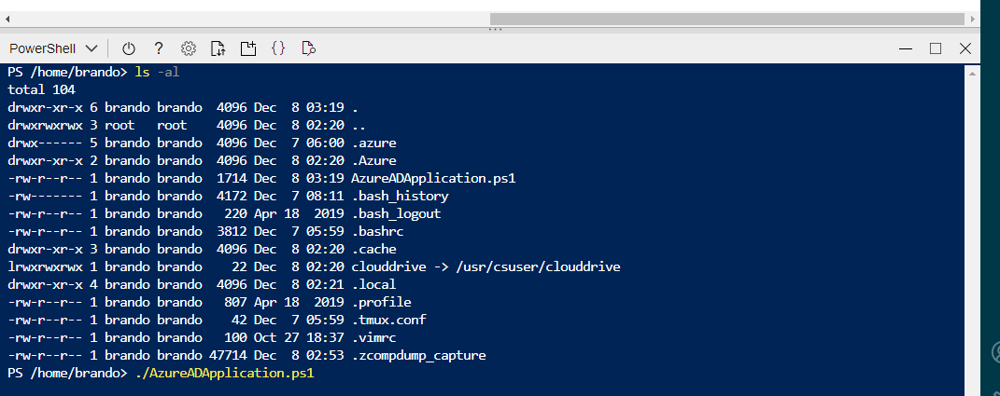

[僅供MSP維運人員]

# 以 CSP 登入租用戶端 Azure Portal
> 進入 MyCustomers ，選擇要設定的租用戶資源，進入該租用戶的 Azure Portal
## 開啟 Cloud Shell，進入 PowerShell Consol
> 若不知道 Cloud Shell 可參考[官方設定教學](https://docs.microsoft.com/zh-tw/azure/cloud-shell/overview)

## 上載並執行 AzureADApplication.ps1
* [另存檔案下載 AzureADApplication.ps1](https://raw.githubusercontent.com/mcloud-support/arm/main/workspace/AzureADApplication.ps1)
* Cloud Shell Upload AzureADApplication.ps1
* 
* 執行 AzureADApplication.ps1
* 
* 自動完成下列的功能設定
  * 使用 Microsoft身分識別平台註冊 MCB Monitor 應用程式
    * 此功能是讓用戶端 Azure 與 MCB Monitor應用程式產生信任關係，方能進行遠端調用監控資訊 [Reference from Azure Docs](https://docs.microsoft.com/en-us/azure/active-directory/develop/quickstart-register-app)
  * 註冊 MCB Monitor Portal 應用程式
    * 註冊 MCB Monitor Portal 應用程式與租用戶的 Microsoft 身分識別平台之間建立信任關係。
    * 產生 MCB Monitor 應用程式用戶端ID、租用戶ID與密碼，請記錄留存
    * 指派角色給 MCB Monitor 應用程式
    * 設定 MCB Monitor 應用程式存取的資源與功能
## 執行完成產生的資訊供後續設定使用
- 
- Directory (tenant) ID
- Application (client) ID
- Client secret 此值在您離開執行頁面後就「不會再次顯示」，若忘記，僅能重新產生

### 故障排除

#### 1. 忘記應用程式用戶端密碼，重新產生
- 在 Azure 入口網站的 應用程式註冊 中，選取上述應用程式 mon.mcloud.cht.com.tw
- 選取 Certificates & secrets.
- 選取 Client secrets -> New client secret.
  - 新增用戶端密碼的描述n : mon.mcloud.cht.com.tw
  - 選取持續時間 : Never
  - 選取 [新增] 
  - 記錄 Client secrets 產生的 Value (非ID) 稍後需用於 MCB 用戶端監視服務功能設定 - 此值在您離開此頁面後就「不會再次顯示」，若忘記，僅能重新產生
#### 2.設定 MCB Monitor 應用程式存取額外的資源與功能
- 回到 [Azure Active Directory] 
- 在 [管理]下選取 [應用程式註冊]，在應用程式註冊 中，選取上述應用程式 mon-mcloud-cht-com-tw
- 選取左列管理的 API permissions
- 新增一個 permission 選 APIs my organization uses
- 選擇下方 Log Analytics API 點擊進入設定
- 選擇 Delegated permissions
  - 勾選 Data.Read / Read Log Analytics data as user
- Add permissions 完成該項權限設定
- 依照上列方法，可自行增加其他監控完權限設定，例如 Azure Stroage

# 以維運人員身分登入 MCB Monitor Portal 
## 1.設定 MCB Monitor 應用程式服務端資料來源
- 請先向 MCB Poratl Admin 確定您擁有管理 MCB Monitor Portal 的 Admin 權限
- 登入 MCB Monitor Portal，切換到用戶所分配的 Org Id
- 點選 MCB Monitor Portal 左側 Configuration 選擇新增 Data Source
- 在搜尋處輸入 Azure Monitor
- 選擇 Azure Monitor 之後，在 Azure Monitor Details 輸入前述程序紀錄的下列資訊
- Directory (tenant) ID
- Application (client) ID
- Client secret
- 按下 Load Subscriptions，選擇您要納管監控的 Subscription ID (一個 Monitor Data Source 對應一個 Subscription ID)
- 在 Azure Log Analytics API Details 資訊處
- 關閉 Same details as Azure Monitor API 按鈕
- 再次輸入 Directory (tenant) ID
- Application (client) ID
- Client secret
- 按下 Load Subscriptions，選擇您要納管監控的 Subscription ID
- 按下 Load Workspaces
- 會自動帶出先前在用戶端建立的 Workspace
- 按下 Save & Test ，出現成功訊息即完成設定
- 選擇 Back 離開

## 2.匯入基本儀錶板
- 點選 MCB Monitor Portal 左側 + 號，Create > Import 如下 ID
- Microsoft Azure Storage: 9962
- Azure Virtual Machine: 10532
- Azure Service Bus: 10533
- Azure Redis: 10534
- Azure PostgreSQL: 10535
- Azure MySQL: 10536
- Azure MongoDB: 10537
- Azure Event Hub: 10538
- DocumentDB / Cosmos DB: 10539
- Azure Data Lake Store Account: 10540
- Data factory factories: 10541
- Azure Monitor for Containers - Metrics: 10956
- AKS Container Insights: 12180
- Azure Windows Virtual Desktop Overview:12636
- AKS Monitor Container: 12817
- Azure Network Policy Dashboard based on Azure Monitor: 13102

## 3.匯入MCB進階儀錶板
> 進階儀錶板會使用客製化指標，需確定 VM 使用 ExistingVmOnboardingTemplate.json 納管指定的 VM 啟用 Agent 監控 

> 可參考 VM 監控章節[由此處進入](https://github.com/mcloud-support/arm/tree/main/alert/vm/README.md)
- 點選 MCB Monitor Portal 左側 + 號，Create > Import，顯示Import功能頁後，在上方 Upload JSON file按鈕，載入如下 JSON file
- 一般 VM 儀錶板範本 [download Azure VM Multiple Panels-MCB](https://raw.githubusercontent.com/mcloud-support/arm/main/dashboard/Azure%20VM%20Multiple%20Panels-MCB.json) 
- Apache VM 儀錶板範本 [download Azure Apache VM Multiple Panels-MCB](https://raw.githubusercontent.com/mcloud-support/arm/main/dashboard/Azure%20Apache%20VM%20Multiple%20Panels-MCB.json) 

## 4.(Option) 設定 MCB Monitor Alert 轉發功能整合至 MCB 事件中心
- 點選 MCB Monitor Portal 左側 Alerting > Notification Channels
- Add Channel
- Name: 任意名稱
- Type 選擇 webhook
- Url 填入前述在用戶端執行部署所回傳的 logicAppUrl
- Notification settings 資訊處，可選擇勾選 Default, Include image, Send reminders
- Save
